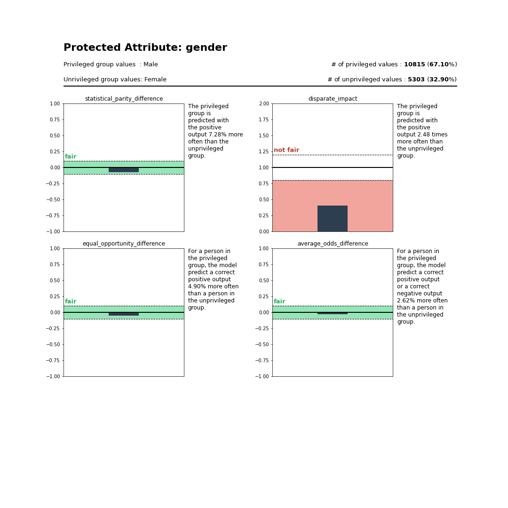
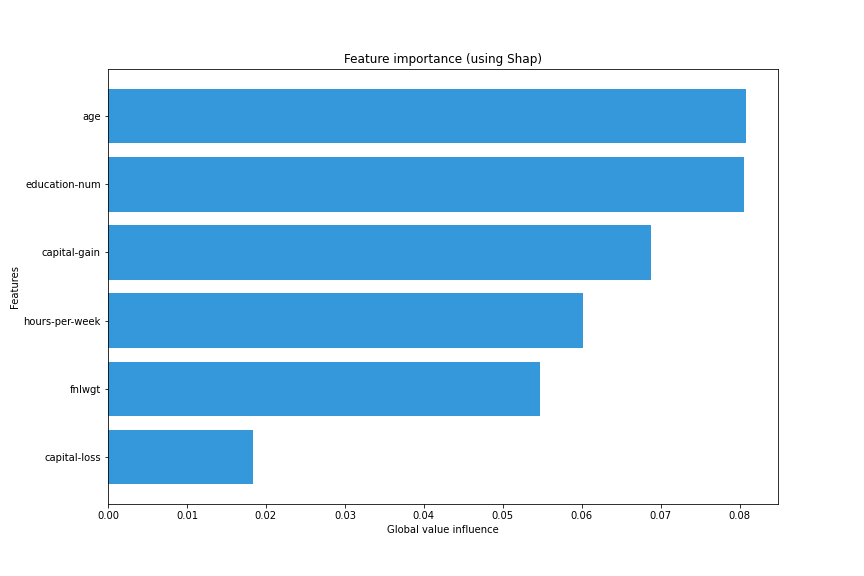
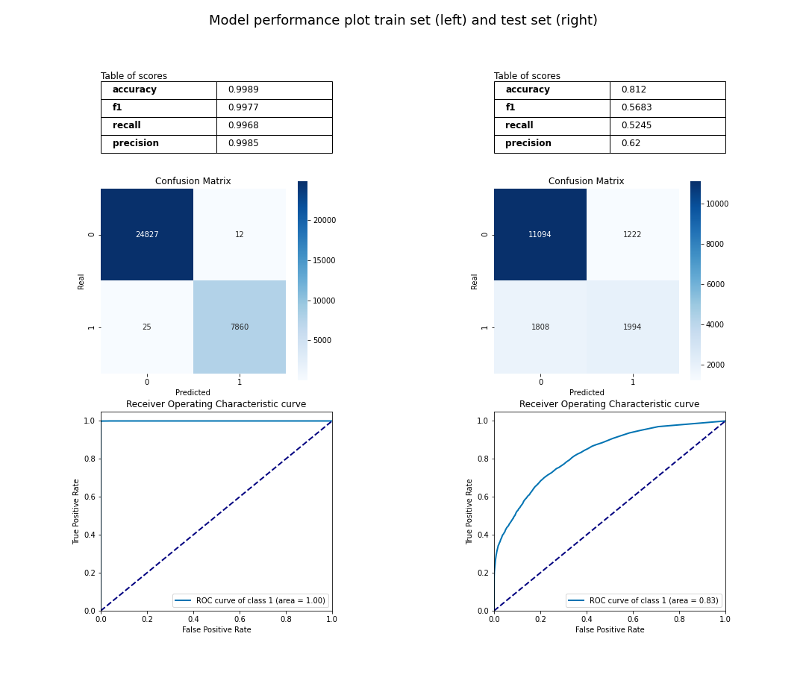
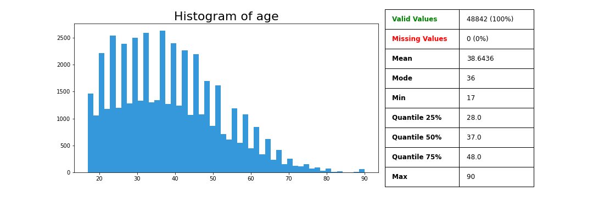
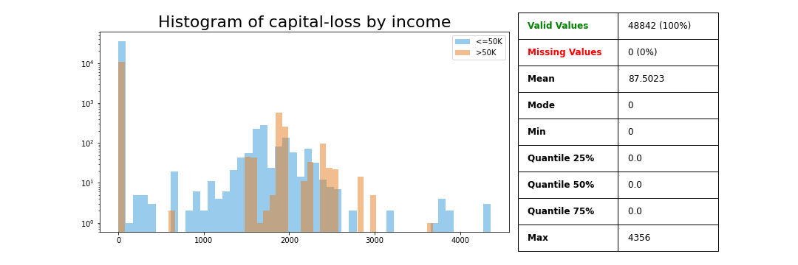
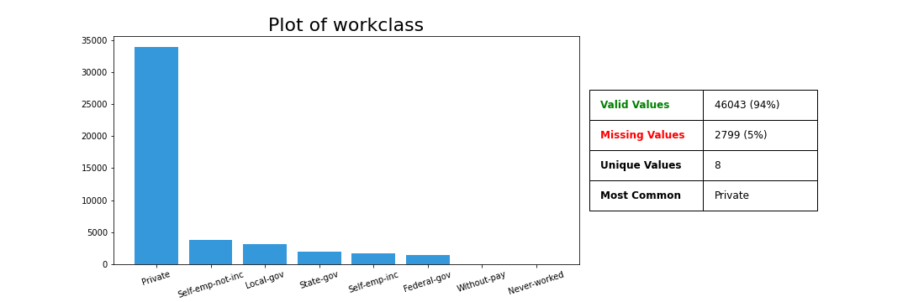
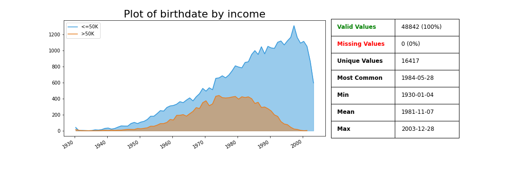
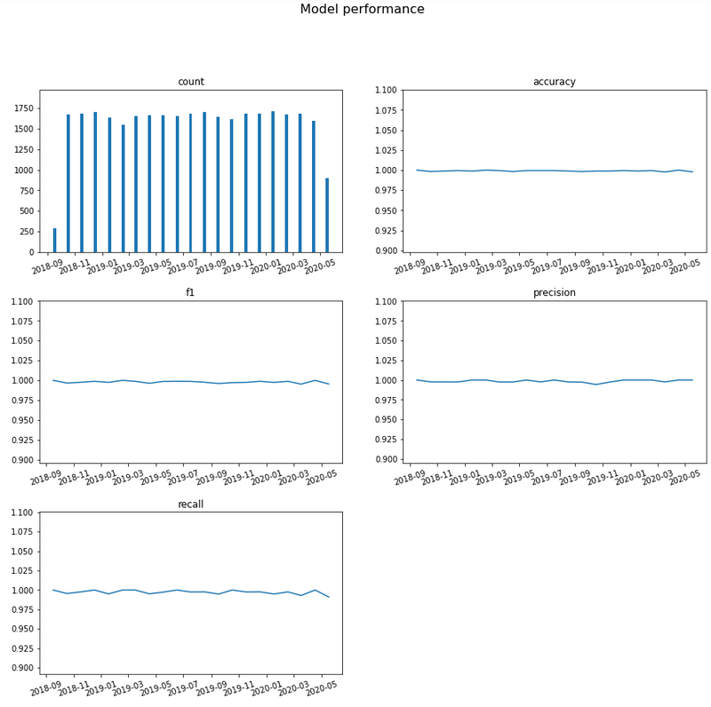
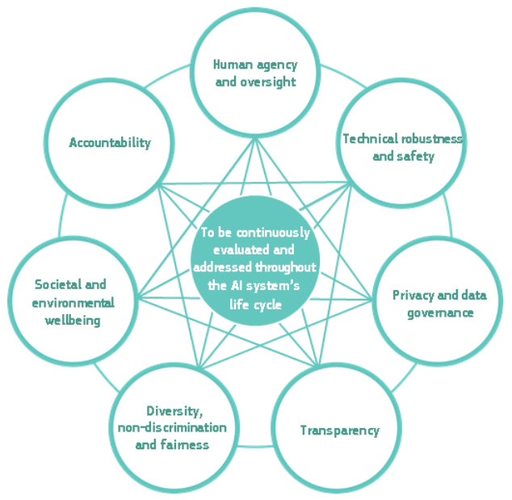

# TransparentAI
*Is my AI ethic ?*

[](https://travis-ci.com/Nathanlauga/transparentai)
[](http://transparentai.readthedocs.io/en/latest/?badge=latest)
[](https://badge.fury.io/py/transparentai)
[](https://pypi.python.org/pypi/ansicolortags/)
[](https://www.python.org/downloads/release/python-360/)

TransparentAI is a toolbox in Python to answer the question "Is my AI ethic ?" based on the European Commission requierements.

## Why this tool ?

The research of ethic in the Artificial Intelligence field is a hot topic. More than 70 papers between 2016 and 2019 ([Algorithm Watch, 2019](https://algorithmwatch.org/en/project/ai-ethics-guidelines-global-inventory/)). But many papers just present the question of "What should be an ethic AI" not the "How to do it". In consequence, many developers become fustrated and still don't really know to do it in practive ([Peters, May 2019](https://medium.com/ethics-of-digital-experience/beyond-principles-a-process-for-responsible-tech-aefc921f7317)).

`TransparentAI` is an answer to this question. The philosophy is that, in coherence with the [Ethics Guidelines for Trustworthy AI](https://ec.europa.eu/futurium/en/ai-alliance-consultation) by the European Commission, you can find out easily (in Python) if **"your AI is ethic"** !

**New tool :** This is a new tool so if you found any bugs or other kind of problems please do not hesitate to report them on the
issues GitHub page from the library here : https://github.com/Nathanlauga/transparentai/issues. I hope you will enjoy this tool and help me to improve it!

Documentation is available here : [API Documentation](https://transparentai.readthedocs.io/en/latest/).

## Table of content

1. [Installation](#installation)
2. [Compatible model and data type](#compatible-model-and-data-type)
3. [Getting started](#getting-started)
    - [Is my model biased ?](#is-my-model-biased-)
    - [How can I explain my model ?](#how-can-i-explain-my-model-)
    - [What's my model performance ?](#whats-my-model-performance-)
    - [What is in my data ?](#what-is-in-my-data-)
    - [How can I know is still good over time ?](#how-can-i-know-the-model-is-still-good-over-time-)
    - [Is my model sustainable ?](#is-my-model-sustainable-)
    - [Do I use safe packages ?](#do-i-use-safe-packages-)
4. [UE Commision requirements](#ue-commision-requirements)
5. [Contributing](#contributing)
6. [Credits and ressources](#credits-and-ressources)
7. [Author](#author)
8. [License](#license)

## Installation

You can install it with [PyPI](https://pypi.org/project/transparentai/) :
```
pip install transparentai
```

Or by cloning [GitHub repository](https://github.com/Nathanlauga/transparentai/)

```
git clone https://github.com/Nathanlauga/transparentai.git
cd transparentai
python setup.py install
```

*****

## Compatible model and data type

**Version 0.2** :

| Objects   | What the tool can handle                                              |
| --------- | ----------------------------------------------------------------- |
| **Data**  | can only handle `tabular` dataset (numpy array, pandas DataFrame) |
| **Model** | can only handle `classification` and `regression` model           |

**Coming for version 0.3** : 

- Data : Explore Image dataset, Text dataset
- Model : Clustering model

*****

## Getting started 

**Take a look on the [Getting started](https://transparentai.readthedocs.io/en/latest/getting-started.html) page of the documentation or you can search specific use cases in the [`examples/`](examples/) directory.**

In this section I created a binary classifier based on [Adult dataset](http://archive.ics.uci.edu/ml/datasets/Adult). The following variables will be used :

| variable       | description                      |
| -------------- | -------------------------------- |
| `data`         | Adult dataset as DataFrame       |
| `clf`          | Classifier model                 |
| `y_true`       | True labels for train set        |
| `y_true_valid` | True labels for valid set        |
| `y_pred`       | Predictions labels for train set |
| `y_pred_valid` | Predictions labels for valid set |
| `df_valid`     | Dataframe for valid set          |
| `X_train`      | Features for train set           |
| `X_valid`      | Features for valid set           |


### Is my model biased ?

```python
privileged_group = {
    # For gender attribute Male peoples are considered to be privileged
    'gender':['Male'],                
    # For marital-status attribute Married peoples are considered to be privileged
    'marital-status': lambda x: 'Married' in x,
    # For race attribute White peoples are considered to be privileged
    'race':['White']
}

from transparentai import fairness
fairness.model_bias(y_true_valid, y_pred_valid, df_valid, privileged_group)
```

Output:

```
{
    "gender": {
        "statistical_parity_difference": -0.07283528047741014,
        "disparate_impact": 0.4032473042703101,
        "equal_opportunity_difference": -0.04900038770381182,
        "average_odds_difference": -0.026173142849183567
    },
    "marital-status": {
        "statistical_parity_difference": -0.11667610209029305,
        "disparate_impact": 0.27371312304160633,
        "equal_opportunity_difference": 0.08345535064884008,
        "average_odds_difference": 0.03867329810319946
    },
    "race": {
        "statistical_parity_difference": -0.0420778376239787,
        "disparate_impact": 0.5964166117990216,
        "equal_opportunity_difference": -0.0004408949904296522,
        "average_odds_difference": -0.002870373184105955
    }
}
```

This metrics can be not easy to understand so you can use the `returns_text=True` so that you can get ths insight :

```python
fairness_txt = fairness.model_bias(y_true_valid, y_pred_valid, df_valid, privileged_group, returns_text=True)
print(fairness_txt['gender'])
```
Output:
```
The privileged group is predicted with the positive output 7.28% more often than the unprivileged group. This is considered to be fair.
The privileged group is predicted with the positive output 2.48 times more often than the unprivileged group. This is considered to be not fair.
For a person in the privileged group, the model predict a correct positive output 4.90% more often than a person in the unprivileged group. This is considered to be fair.
For a person in the privileged group, the model predict a correct positive output or a correct negative output 2.62% more often than a person in the unprivileged group. This is considered to be fair.
The model has 3 fair metrics over 4 (75%).
```

And if you like to get visual help use the `plot_bias` function :

```python
privileged_group = {'gender': ['Male']}

from transparentai import fairness
fairness.plot_bias(y_true_valid, y_pred_valid, df_valid, privileged_group, with_text=True)
```



### How can I explain my model ?

```python
from transparentai.models import explainers
explainer = explainers.ModelExplainer(clf, X_train, model_type='tree')

explainer.explain_global_influence(X_train, nsamples=1000)
```
Output:
```
{
    'age': 0.08075649984055841,
    'fnlwgt': 0.05476459574744569,
    'education-num': 0.08048316800088552,
    'capital-gain': 0.06879137962639843,
    'capital-loss': 0.018367250661071737,
    'hours-per-week': 0.06009733425389803
}
```

```python
explainer.plot_global_explain()
```


```python
explainer.plot_local_explain(X_valid.iloc[0])
```


### What's my model performance ?

```python
from transparentai.models import classification

# You can use custom function with lambda
metrics = ['accuracy', 'roc_auc', 'f1', 'recall', 'precision', lambda y_true, y_pred: sum(y_true-y_pred)]
classification.compute_metrics(y_true_valid, y_pred_valid, metrics)
```
Output:
```
{
    'accuracy': 0.812011415808413,
    'roc_auc': 0.8272860034692258,
    'f1': 0.5682530635508691,
    'recall': 0.5244608100999474,
    'precision': 0.6200248756218906,
    'custom_1': 586
}
```

```python
classification.plot_performance(y_true, y_pred, y_true_valid, y_pred_valid)
```


### What is in my data ?

```python
from transparentai.datasets import variable

variable.plot_variable(data['age'])
```


```python
variable.plot_variable(data['capital-loss'], legend=data['income'], ylog=True)
```


```python
variable.plot_variable(data['workclass'])
```


The `birthdate` column was generated based on the `age` column.

```python
variable.plot_variable(data['birthdate'], legend=data['income'])
```


### How can I know the model is still good over time ?

`timestamp` variable was generated randomly, it represents the time of the prediction.

```python
from transparentai import monitoring

monitoring.plot_monitoring(y_true, y_pred, timestamp, interval='month', classification=True)
```



### Is my model sustainable ?

```python
import transparentai.utils as utils
kWh, clf = utils.evaluate_kWh(clf.fit, X, Y, verbose=True)
```
Output:
```
Location:                                                                 France
Baseline wattage:                                                     4.79 watts
Process wattage:                                                     18.45 watts
--------------------------------------------------------------------------------
-------------------------------  Final Readings  -------------------------------
--------------------------------------------------------------------------------
Average baseline wattage:                                             3.53 watts
Average total wattage:                                               16.04 watts
Average process wattage:                                             12.51 watts
Process duration:                                                        0:00:07
--------------------------------------------------------------------------------
-------------------------------   Energy Data    -------------------------------
--------------------------------------------------------------------------------
                              Energy mix in France                              
Coal:                                                                      3.12%
Petroleum:                                                                16.06%
Natural Gas:                                                              33.56%
Low Carbon:                                                               47.26%
--------------------------------------------------------------------------------
-------------------------------    Emissions     -------------------------------
--------------------------------------------------------------------------------
Effective emission:                                              1.32e-05 kg CO2
Equivalent miles driven:                                          5.39e-12 miles
Equivalent minutes of 32-inch LCD TV watched:                   8.14e-03 minutes
Percentage of CO2 used in a US household/day:                          4.33e-12%
--------------------------------------------------------------------------------
------------------------- Assumed Carbon Equivalencies -------------------------
--------------------------------------------------------------------------------
Coal:                                                      995.725971 kg CO2/MWh
Petroleum:                                                816.6885263 kg CO2/MWh
Natural gas:                                              743.8415916 kg CO2/MWh
Low carbon:                                                         0 kg CO2/MWh
--------------------------------------------------------------------------------
-------------------------     Emissions Comparison     -------------------------
--------------------------------------------------------------------------------
                      Quantities below expressed in kg CO2                      
        US                      Europe                  Global minus US/Europe
Max:    Wyoming        2.85e-05 Kosovo         2.93e-05 Mongolia        2.86e-05
Median: Tennessee      1.40e-05 Ukraine        2.04e-05 Korea, South    2.34e-05
Min:    Vermont        8.00e-07 Iceland        5.26e-06 Bhutan          3.26e-06
--------------------------------------------------------------------------------
--------------------------------------------------------------------------------
Process used:                                                       3.10e-05 kWh
```

### Do I use safe packages ?

```python
import transparentai.utils as utils
utils.check_packages_security(full_report=True)
```
Output:
```
+==============================================================================+
|                                                                              |
|                               /$$$$$$            /$$                         |
|                              /$$__  $$          | $$                         |
|           /$$$$$$$  /$$$$$$ | $$  \__//$$$$$$  /$$$$$$   /$$   /$$           |
|          /$$_____/ |____  $$| $$$$   /$$__  $$|_  $$_/  | $$  | $$           |
|         |  $$$$$$   /$$$$$$$| $$_/  | $$$$$$$$  | $$    | $$  | $$           |
|          \____  $$ /$$__  $$| $$    | $$_____/  | $$ /$$| $$  | $$           |
|          /$$$$$$$/|  $$$$$$$| $$    |  $$$$$$$  |  $$$$/|  $$$$$$$           |
|         |_______/  \_______/|__/     \_______/   \___/   \____  $$           |
|                                                          /$$  | $$           |
|                                                         |  $$$$$$/           |
|  by pyup.io                                              \______/            |
|                                                                              |
+==============================================================================+
| REPORT                                                                       |
| checked 77 packages, using default DB                                        |
+==============================================================================+
| No known security vulnerabilities found.                                     |
+==============================================================================+
```

*****

## UE Commision requirements

The European Commission defined seven requirements that allow to make a trustworthy AI.

These requirements are applicable to different stakeholders partaking in AI systems’ life cycle: developers, deployers and end-users, as well as the broader society. By developers, we refer to those who research, design and/or develop AI systems. By deployers, we refer to public or private organisations that use AI systems within their business processes and to offer products and services to others. End-users are those engaging with the AI system, directly or indirectly. Finally, the broader society encompasses all others that are directly or indirectly affected by AI systems. Different groups of stakeholders have different roles to play in ensuring that the requirements are met:

- Developers should implement and apply the requirements to design and development processes.
- Deployers should ensure that the systems they use and the products and services they offer meet the requirements.
- End-users and the broader society should be informed about these requirements and able to request that they are upheld.

The below list of requirements is non-exhaustive. 35 It includes systemic, individual and societal aspects:

1. **Human agency and oversight**:
Including fundamental rights, human agency and human oversight
2. **Technical robustness and safety**:
Including resilience to attack and security, fall back plan and general safety, accuracy, reliability and reproducibility
3. **Privacy and data governance**:
Including respect for privacy, quality and integrity of data, and access to data
4. **Transparency**:
Including traceability, explainability and communication
5. **Diversity, non-discrimination and fairness**:
Including the avoidance of unfair bias, accessibility and universal design, and stakeholder participation
6. **Societal and environmental wellbeing**: 
Including sustainability and environmental friendliness, social impact, society and democracy
7. **Accountability**: 
Including auditability, minimisation and reporting of negative impact, trade-offs and redress.

<div style='width=100%;text-align:center;'>

</div>

This table allows you to in details for each requirements and if it's possible how to control if the aspect is ethic with `TransparentAI`. Some aspects do not have technical implementation in this tool because it requires legal or other knowledge. If you want to understand the differents aspect and requirements you can read details in the [Ethics Guidelines for Trustworthy AI](https://ec.europa.eu/futurium/en/ai-alliance-consultation) paper.

| UE requirements | Aspect | `TransparentAI` implementation |
| ----------- | ------------- | ----------- |
| **1. Human agency and oversight** | Fundamental rights | No technical implementation. |
|                            | Human agency | No technical implementation. |
|                            | Human oversight | [Control AI performance over time with `monitoring.monitor_model` or `monitoring.plot_monitoring`](examples/#control-ai-performance-over-time-with-monitoringmonitor_model-or-monitoringplot_monitoring) |
| **2. Technical robustness and safety** | Resilience to attack and security | [Try different input scenario in the model to see how it handles it with `models.explainers.ModelExplainer`](examples/#try-different-input-scenario-in-the-model-to-see-how-it-handles-it-with-modelsexplainersmodelexplainer) |
|                            | Fallback plan and general safety | [Check if your Python's package are secure with `utils.check_packages_security`](examples/#check-if-your-pythons-package-are-secure-with-utilscheck_packages_security) |
|                            | Accuracy | [Validate your AI performance with `models.classification.plot_performance` or `models.regression.plot_performance`](examples/#validate-your-ai-performance-with-modelsclassificationplot_performance-or-modelsregressionplot_performance) |
|                            | Reliability and Reproducibility | No technical implementation. |
| **3. Privacy and data governance** | Privacy and data protection | No technical implementation. |
|                            | Quality and integrity of data | [Check if the variable is coherent in its distribution with `datasets.variable.plot_variable`](examples/#check-if-the-variable-is-coherent-in-its-distribution-with-datasetsvariableplot_variable) |
|                            | Access to data | No technical implementation. |
| **4. Transparency** | Traceability | [Generate a performance validation report with `utils.reports.generate_validation_report`](examples/#generate-a-performance-validation-report-with-utilsreportsgenerate_validation_report) |
|                            | Explainability | [Explain the local or global behavior of your model with `models.explainers.ModelExplainer`](examples/#explain-the-local-or-global-behavior-of-your-model-with-modelsexplainersmodelexplainer)|
|                            | Communication | No technical implementation. |
| **5. Diversity, non-discrimination and fairness** | Avoidance of unfair bias |[Check if your AI is biased on protected attributes with `fairness.model_bias` or `fairness.plot_bias`](examples/#check-if-your-ai-is-biased-on-protected-attributes-with-fairnessmodel_bias-or-fairnessplot_bias) |
|                            | Accessibility and universal design | No technical implementation. |
|                            | Stakeholder Participation | No technical implementation. |
| **6. Societal and environmental well-being** | Sustainable and environmentally friendly AI | [Get the kWh value of the AI training with `utils.evaluate_kWh`](examples/#get-the-kwh-value-of-the-ai-training-with-utilsevaluate_kwh) |
|                            | Social impact | [Check if your AI is biased on protected attributes with `fairness.model_bias` or `fairness.plot_bias`](examples/#check-if-your-ai-is-biased-on-protected-attributes-with-fairnessmodel_bias-or-fairnessplot_bias) |
| **7. Accountability** | Auditability | [Generate a performance validation report with `utils.reports.generate_validation_report`](examples/#generate-a-performance-validation-report-with-utilsreportsgenerate_validation_report) |
|                            | Minimisation and reporting of negative impacts | No technical implementation. |
|                            | Trade-offs | No technical implementation. |
|                            | Redress | No technical implementation. |

*****

## Contributing

See the [contributing file](CONTRIBUTING.md).

*PRs accepted.*

*****

## Credits and ressources

### `fairness` submodule

For this submodule, I have to say I was mainly inspired by one tool so all the credit has to be attributed to [AIF360 by IBM](http://aif360.mybluemix.net/).

I used some of the metrics proposed in the tools (`Statistical Parity Difference`, `Equal Opportunity Difference`, `Average Odds Difference`, `Disparact Impact` and `Theil Index`).

### `models.evaluation` submodule

I used some metrics function of the [`scikit-learn`](https://scikit-learn.org/stable/index.html) Python package.

### `models.explainers` submodule

I choose to used the [Shap](https://github.com/slundberg/shap) library because this tool was tested and aproved by a lot of people in the community, and even if I found some papers showing some problems (e.g. "Fooling LIME and SHAP: Adversarial Attacks on Post hoc Explanation Methods" [(Slack and al., November 2019)](https://arxiv.org/abs/1911.02508)), I decided to use it because if you want to biased Shap, you have to do it intentionally at the AI creation.

### Plotting functions

I was inspired by some graphics on [Kaggle](https://www.kaggle.com/). But mainly I use some code on [matplotlib website](https://matplotlib.org/) and the [Python graph gallery](https://python-graph-gallery.com/).

### `utils.external` functions

I used different packages that implement great features such as :

1. [`energyusage`](https://github.com/responsibleproblemsolving/energy-usage) : A Python package that measures the environmental impact of computation.
2. [`safety`](https://github.com/pyupio/safety) : Safety checks your installed dependencies for known security vulnerabilities.

Again thanks to researchers and developers that contributed in this really important field, without them I don't think I'll be able to create this tool.

*****

## Author

This work is led by [Nathan Lauga](https://github.com/nathanlauga/), french Data Scientist.

*****

## License

This project use a [MIT License](LICENSE).

**Why ?**

I believe that the code should be re-used for community projects and also inside private projects. 
AI transparency needs to be available for everyone even it's a private AI.