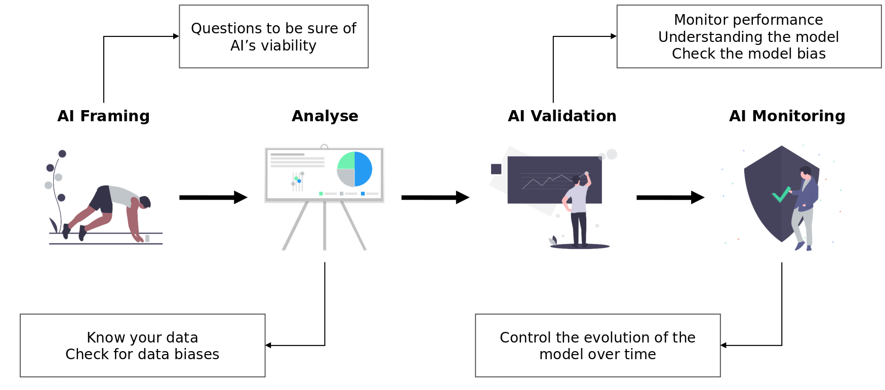
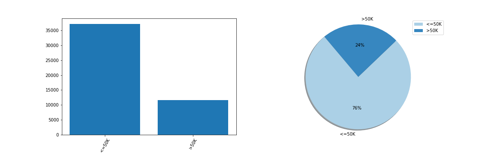
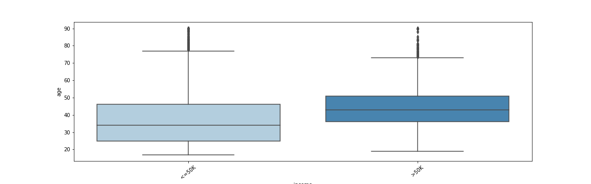
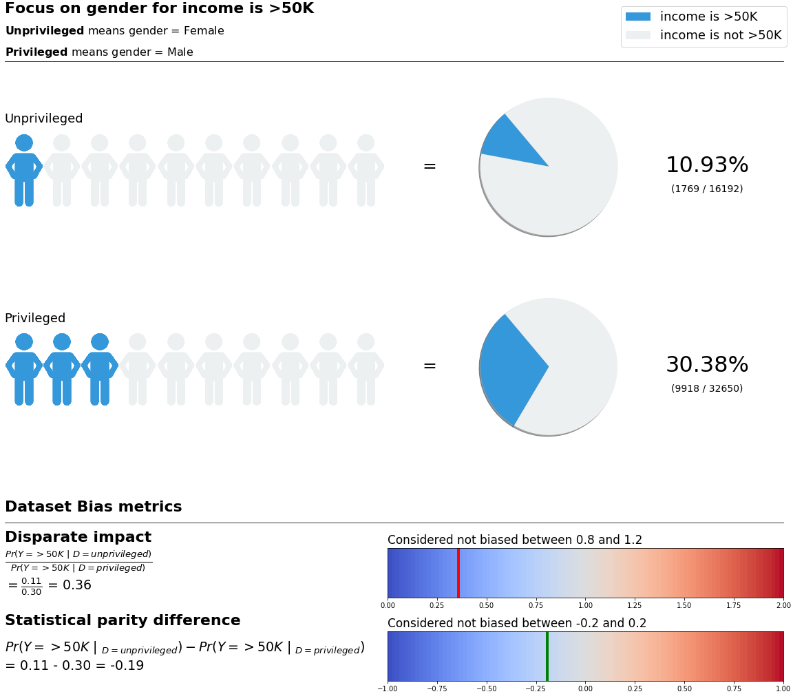
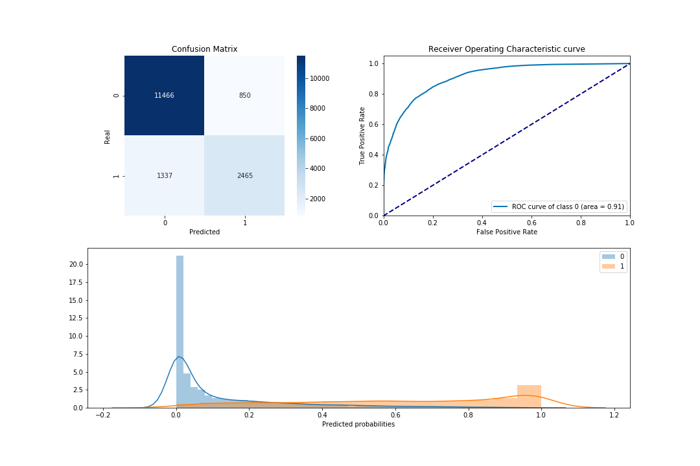
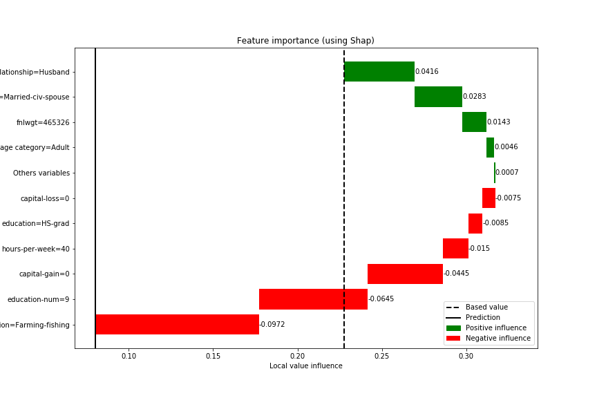

# TransparentAI
*A transparent AI from A to Z!*

[](http://transparentai.readthedocs.io/en/latest/?badge=latest)
[](https://badge.fury.io/py/transparentai)

This library is a toolbox so that you can create or inspect an AI on every step of the pipeline.

This is a new tool so if you found any bugs or other kind of problems please do not hesitate to report them on the
issues GitHub page from the library here : https://github.com/Nathanlauga/transparentai/issues.



Documentation is available here : [API Documentation](https://transparentai.readthedocs.io/en/latest/).

## Installation

You can install it with [PyPI](https://pypi.org/project/transparentai/) :
```
pip install transparentai
```

Or by cloning [GitHub repository](https://github.com/Nathanlauga/transparentai/)

```
git clone https://github.com/Nathanlauga/transparentai.git
cd transparentai
python setup.py install
```

## Library tools

Supported objects:

| submodule   | object              | description                                                              |
| ----------- | ------------------- | ------------------------------------------------------------------------ |
| `datasets`  | StructuredDataset   | Can handle Structured dataset (tabular)                                  |
| `models`    | ClassificationModel | Can handle classifier model with `predict` and `predict_proba` functions |
| `models`    | RegressionModel     | Can handle regression model with a `predict` function                    |
| `fairness`  | DatasetBiasMetric   | Can handle a dataset with a target column                                |
| `fairness`  | ModelBiasMetric     | Can handle a dataset and predictions (Classification and regression)     |
| `explainer` | ModelExplainer      | Can handle tree and linear model                                         |

## How to use it

Take a look on the [Getting started](https://transparentai.readthedocs.io/en/latest/getting-started.html) page of the documenation or you can search specific use cases 
in the [`notebooks/`](notebooks/) directory.

Here is some example for the `StructuredDataset`, `DatasetBiasMetric`, `ClassificationModel` 
and `ModelExplainer`. But I take a look on the links above, there are a lot more to see!

### StructuredDataset

Using the Adult dataset which is include in the library let's observe
the data with some graphics.

```
from transparentai.datasets import StructuredDataset, load_adult
adult = load_adult()
```

Create the StructuredDataset object :

```
# target is not mandatory it just split data in the graphics for each target value
dataset = StructuredDataset(df=adult, target='income')
```

Then you can use differents plotting functions to have a better
understanding of the dataset.

To start I recommend the following :

```
dataset.plot_dataset_overview() # Shows an overview of the data
dataset.plot_missing_values() # Plots missing values
dataset.plot_variables() # Plots each variable, one by one
dataset.plot_numeric_var_relation() # Plots each numeric var pair
dataset.plot_cat_and_num_variables() # Plots each numeric and categorical var pair
dataset.plot_correlations() # Plots correlations
```

But if you want to see a particular variable or variable combination
you can use the following line of codes :

```
dataset.plot_one_categorical_variable(var='income')
```


```
dataset.plot_two_numeric_variables(var1='education-num', var2='hours-per-week', nrows=10000)
```


```
dataset.plot_one_cat_and_num_variables(var1='relationship', var2='age')
```


```
dataset.plot_one_cat_and_num_variables(var1='income', var2='age')
```




### DatasetBiasMetric

Import DatasetBiasMetric class.

```
from transparentai.fairness import DatasetBiasMetric
```

Define privileged_groups

```
privileged_groups = {
    'marital-status': ['Married-civ-spouse','Married-AF-spouse'],
    'race': ['White'],
    'gender': ['Male']
}
```

Create the instance

```
dataset_bias = DatasetBiasMetric(dataset, privileged_groups, favorable_label='>50K')
```

Retrieve the bias metrics as a pandas DataFrame

```
dataset_bias.get_bias_metrics()
 		                Disparate impact 	Statistical parity difference
attr 	        index 		
age category 	>50K 	0.257312 	        -0.222479
marital-status 	>50K 	0.143299 	        -0.382106
race 	        >50K 	0.600592 	        -0.101445
gender 	        >50K 	0.359655 	        -0.194516
```

Plot one attribute bias.

```
dataset_bias.plot_bias(attr='gender')
```



### ClassificationModel

```
from transparentai.models import ClassificationModel
```

You need a trained classifier to use the ClassificationModel class.
Then with compute_scores() function you will be able to access score.

```
model = ClassificationModel(model=clf)
model.compute_scores(X=X_test, y=y_test, threshold=0.5)
```

Shows classification scores :

```
model.plot_scores()
Overall model performance
	    accuracy 	f1 	        precision 	recall 	    roc_auc
score 	0.864313 	0.860986 	0.859721 	0.864313 	{0: 0.9104387547348203}
```



### ModelExplainer

This class is using [Shap](https://github.com/slundberg/shap/) library to get the feature importance.

```
from transparentai.explainer import ModelExplainer
explainer = ModelExplainer(model=clf, X=X_test, model_type='tree')
```

Get the global feature importance : 

```
# I just take 100 rows for the example
explainer.explain_global(X_test.sample(100))
{'age': 0.04400247162436626,
 'workclass': 0.012615442187332302,
 'fnlwgt': 0.011500706212146071,
 'education': 0.014303318875909592,
 'education-num': 0.06320364016403923,
 'marital-status': 0.04457869696787154,
 'occupation': 0.025353718692010623,
 'relationship': 0.06538595560703962,
 'race': 0.0030357403950878343,
 'gender': 0.008150837046393543,
 'capital-gain': 0.05191285416804516,
 'capital-loss': 0.004889414454684037,
 'hours-per-week': 0.03416860048567794,
 'native-country': 0.003552990714228435,
 'age category': 0.013148817808960036}
```

Global feature importance plot :

```
explainer.plot_global_explain(top=10)
```


The variable `feature_names` is a mapping dictionary so that categorical
variables that are encoded as number (e.g. 'gender': Male is 1 and Female 0)
can retrieve the original values.

```
one_row = X.iloc[42]
explainer.explain_local(one_row, feature_classes=feature_names)
{'age=36': 0.001512160581860371,
 'workclass=Private': -0.001553052083354487,
 'fnlwgt=465326': 0.014316324086275927,
 'education=HS-grad': -0.008492161121589561,
 'education-num=9': -0.06452835138642059,
 'marital-status=Married-civ-spouse': 0.028260101147975548,
 'occupation=Farming-fishing': -0.09721002961961403,
 'relationship=Husband': 0.04156683952625826,
 'race=White': -2.3502936087425042e-05,
 'gender=Male': 0.002139375823244336,
 'capital-gain=0': -0.044484324557015495,
 'capital-loss=0': -0.007543452374593471,
 'hours-per-week=40': -0.014963517277665232,
 'native-country=United-States': -0.0014164286240020375,
 'age category=Adult': 0.004620017927818481}
```

Plot local explanation :
```
explainer.plot_local_explain(one_row, top=10, feature_classes=feature_names)
```



## Contributing

See the [contributing file](CONTRIBUTING.md).

*PRs accepted.*

## Credits and ressources

See the [ressources file](RESSOURCES.md) where I explain why I created this tool and mainly I quote my different inspirations and ressources.

## Author

This work is led by [Nathan Lauga](https://github.com/nathanlauga/), french Data Scientist.

## License

This project use a [MIT License](LICENSE).

**Why ?**

I believe that the code should be re-used for community projects and also inside private projects. 
AI transparency needs to be available for everyone even it's a private AI! 