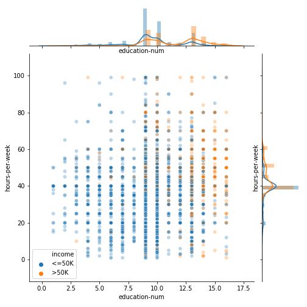
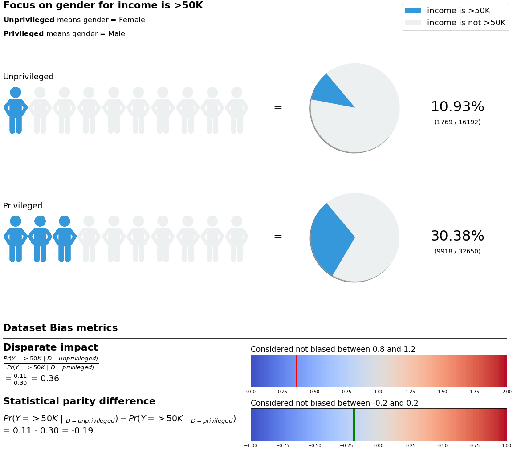
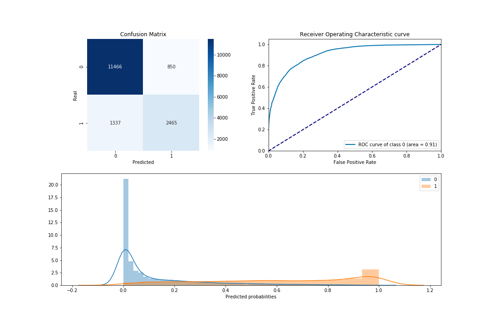

Getting started with TransparentAI
==================================

This page will show you some code to start with the TransparentAI library.

This page will go through :

1. Start the AI
2. Explore data
3. Analyse data bias
4. Analyse model performance
5. Analyse model bias
6. Explain local and global predictions
7. Compare with new data (Monitoring)

You can see details on the following notebook :
`Adult dataset : TransparentAI full pipeline example`_

.. _Adult dataset \: TransparentAI full pipeline example: https://github.com/Nathanlauga/transparentai/notebooks/example_adult_dataset_full_pipeline.ipynb

Start the AI
------------

>>> import transparentai.start as start
>>> start.how_can_i_start()
How can I start
This function is a helper to show some starting possibilities
├── transparentai.start.quick_start() shows you questions about the project. If you complete it, at the end you will have answered questions about if your AI is viable.
├── transparentai.start.external_link() shows you external references that can be more accurate to your AI.

>>> start.quick_start()

Then it asks you **15 questions** about your project in three categories :
Detail and goal, mdoel and metrics and Data.

Explore your dataset
--------------------

Using the Adult dataset which is include in the library let's observe
the data with some graphics.

>>> from transparentai.datasets import StructuredDataset, load_adult
>>> adult = load_adult()

Create the StructuredDataset object :

>>> # target is not mandatory it just split data in the graphics for each target value
>>> dataset = StructuredDataset(df=adult, target='income')

Then you can use differents plotting functions to have a better
understanding of the dataset.

To start I recommend the following :

>>> dataset.plot_dataset_overview() # Shows an overview of the data
>>> dataset.plot_missing_values() # Plots missing values
>>> dataset.plot_variables() # Plots each variable, one by one
>>> dataset.plot_numeric_var_relation() # Plots each numeric var pair
>>> dataset.plot_cat_and_num_variables() # Plots each numeric and categorical var pair
>>> dataset.plot_correlations() # Plots correlations

But if you want to see a particular variable or variable combination
you can use the following line of codes :

>>> dataset.plot_one_categorical_variable(var='income')

.. image:: images/income_variable_plot.png

>>> dataset.plot_two_numeric_variables(var1='education-num', var2='hours-per-week', nrows=10000)

>>> dataset.plot_one_cat_and_num_variables(var1='relationship', var2='age')

.. image:: images/relationship_age_variable_boxplot.png

>>> dataset.plot_one_cat_and_num_variables(var1='income', var2='age')

.. image:: images/income_age_variable_boxplot.png

Analyse dataset bias
--------------------

Import DatasetBiasMetric class.

>>> from transparentai.fairness import DatasetBiasMetric

Define privileged_groups

>>> privileged_groups = {
    'marital-status': ['Married-civ-spouse','Married-AF-spouse'],
    'race': ['White'],
    'gender': ['Male']
}

Create the instance

>>> dataset_bias = DatasetBiasMetric(dataset, privileged_groups, favorable_label='>50K')

Retrieve the bias metrics as a pandas DataFrame

>>> dataset_bias.get_bias_metrics()
 		                Disparate impact 	Statistical parity difference
attr 	        index 		
age category 	>50K 	0.257312 	        -0.222479
marital-status 	>50K 	0.143299 	        -0.382106
race 	        >50K 	0.600592 	        -0.101445
gender 	        >50K 	0.359655 	        -0.194516

Plot one attribute bias.

>>> dataset_bias.plot_bias(attr='gender')

Analyse model performance
-------------------------

>>> from transparentai.models import ClassificationModel

You need a trained classifier to use the ClassificationModel class.
Then with compute_scores() function you will be able to access score.

>>> model = ClassificationModel(model=clf)
>>> model.compute_scores(X=X_test, y=y_test, threshold=0.5)

Shows classification scores :

>>> model.plot_scores()
Overall model performance
	    accuracy 	f1 	        precision 	recall 	    roc_auc
score 	0.864313 	0.860986 	0.859721 	0.864313 	{0: 0.9104387547348203}

Analyse model bias
--------------------

>>> from transparentai.fairness import ModelBiasMetric

To use the ModelBiasMetric I recommend to analyse the bias on the
test set so that the performance metrics are more accurate.

Here `privileged_groups` is the same than the variable at the
**Analyse dataset bias** section.

>>> dataset = StructuredDataset(df=adult_test, target=target)
>>> model_bias = ModelBiasMetric(dataset=dataset, preds=preds,
                                privileged_groups=privileged_groups,
                                favorable_label='>50K')

>>> model_bias.get_bias_metrics()
 	            Disparate impact 	Statistical parity difference 	Equal opportunity difference 	Average abs odds difference 	Theil index
attr 	        index 					
age category 	>50K 	0.239931 	    -0.192626 	    -0.086698 	    0.077004 	    0.107743
marital-status 	>50K 	0.079472 	    -0.373522 	    -0.275016 	    0.226959 	    0.107743
race 	        >50K 	0.516296 	    -0.104626 	    -0.043202 	    0.041003 	    0.107743
gender 	        >50K 	0.302189 	    -0.182018 	    -0.105678 	    0.087605 	    0.107743

>>> model_bias.plot_bias(attr='gender')

Explain local and global predictions
------------------------------------

>>> from transparentai.explainer import ModelExplainer

>>> explainer = ModelExplainer(model=clf, X=X_test, model_type='tree')

>>> # I just take 100 rows for the example
>>> explainer.explain_global(X_test.sample(100))
{'age': 0.04400247162436626,
 'workclass': 0.012615442187332302,
 'fnlwgt': 0.011500706212146071,
 'education': 0.014303318875909592,
 'education-num': 0.06320364016403923,
 'marital-status': 0.04457869696787154,
 'occupation': 0.025353718692010623,
 'relationship': 0.06538595560703962,
 'race': 0.0030357403950878343,
 'gender': 0.008150837046393543,
 'capital-gain': 0.05191285416804516,
 'capital-loss': 0.004889414454684037,
 'hours-per-week': 0.03416860048567794,
 'native-country': 0.003552990714228435,
 'age category': 0.013148817808960036}

Global feature importance plot :

>>> explainer.plot_global_explain(top=10)

.. image:: images/global_feature_influence_plot.png

The variable `feature_names` is a mapping dictionary so that categorical
variables that are encoded as number (e.g. 'gender': Male is 1 and Female 0)
can retrieve the original values.

>>> one_row = X.iloc[42]
>>> explainer.explain_local(one_row, feature_classes=feature_names)
{'age=36': 0.001512160581860371,
 'workclass=Private': -0.001553052083354487,
 'fnlwgt=465326': 0.014316324086275927,
 'education=HS-grad': -0.008492161121589561,
 'education-num=9': -0.06452835138642059,
 'marital-status=Married-civ-spouse': 0.028260101147975548,
 'occupation=Farming-fishing': -0.09721002961961403,
 'relationship=Husband': 0.04156683952625826,
 'race=White': -2.3502936087425042e-05,
 'gender=Male': 0.002139375823244336,
 'capital-gain=0': -0.044484324557015495,
 'capital-loss=0': -0.007543452374593471,
 'hours-per-week=40': -0.014963517277665232,
 'native-country=United-States': -0.0014164286240020375,
 'age category=Adult': 0.004620017927818481}

>>> explainer.plot_local_explain(one_row, top=10, feature_classes=feature_names)

.. image:: images/local_feature_influence_plot.png

Compare with new data (Monitoring)
----------------------------------

>>> from transparentai.monitoring import Monitoring

This class is a little more complicated than the others so
I recommend that you take a look at the last part of the
`Adult dataset : TransparentAI full pipeline example`_ notebook or
at the dedicated notebook : `Example notebook : Monitoring with binary classification`_.

.. _Adult dataset \: TransparentAI full pipeline example: https://github.com/Nathanlauga/transparentai/notebooks/example_adult_dataset_full_pipeline.ipynb
.. _Example notebook \: Monitoring with binary classification: https://github.com/Nathanlauga/transparentai/notebooks/example_monitoring_binary_classification.ipynb

