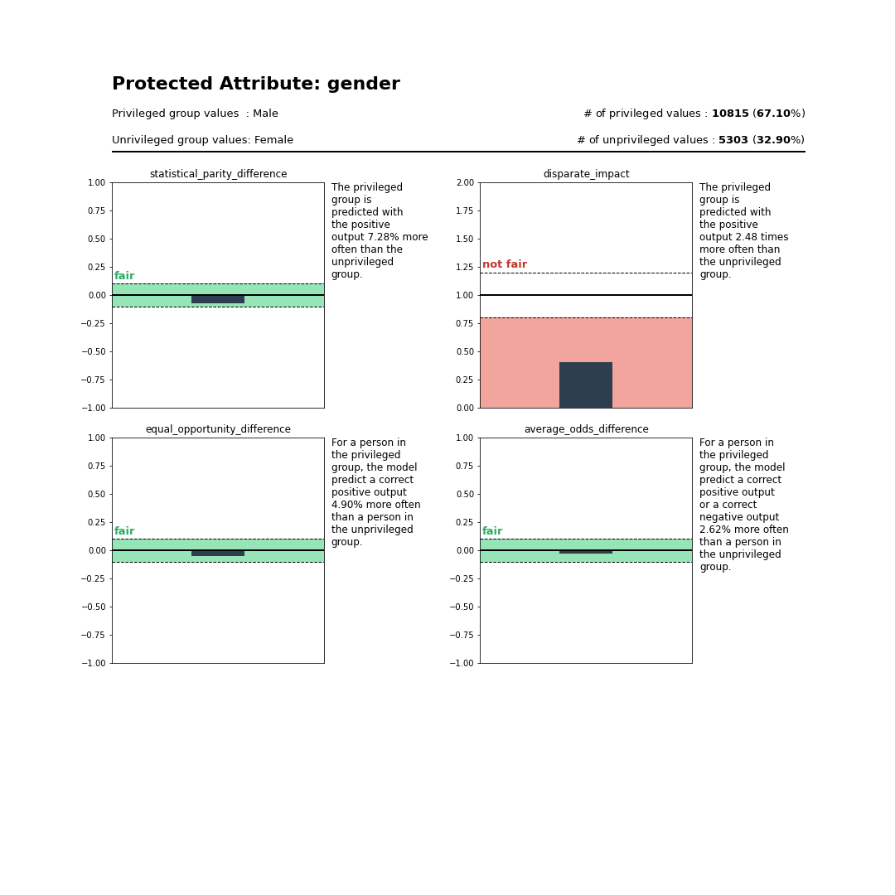
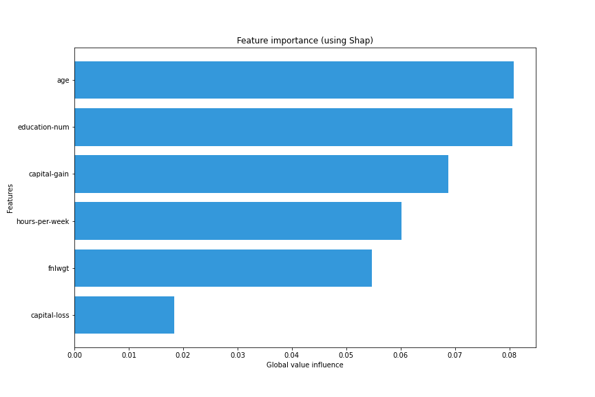
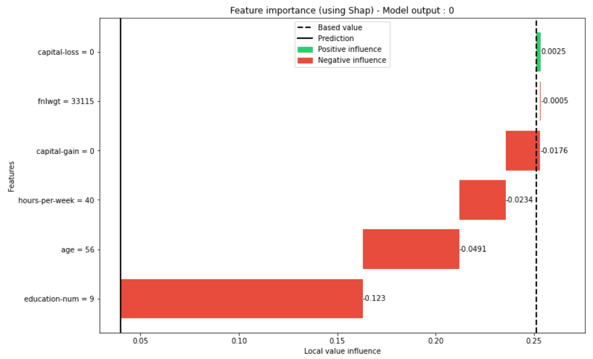
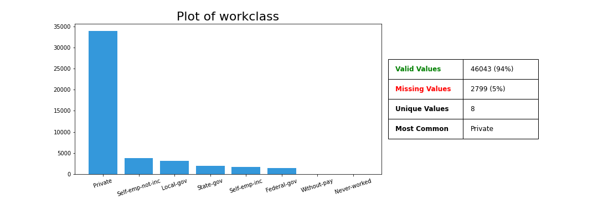
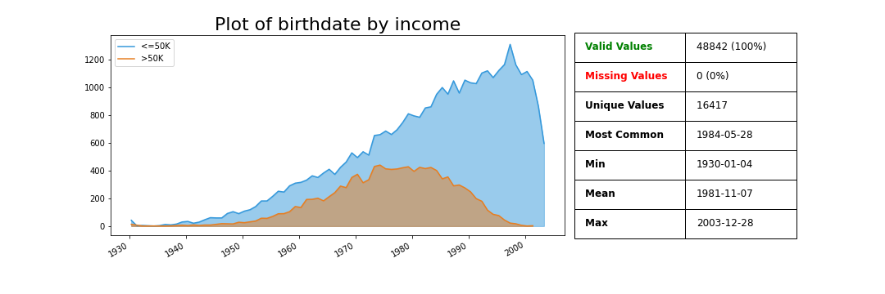

Getting started with TransparentAI
==================================

This page will show you some code to start with the TransparentAI library.

In this section I created a binary classifier based on `Adult dataset`_. The following variables will be used :

.. _Adult dataset: http://archive.ics.uci.edu/ml/datasets/Adult

+----------------+----------------------------------+
| variable       | description                      |
+================+==================================+
| `data`         | Adult dataset as DataFrame       |
+----------------+----------------------------------+
| `clf`          | Classifier model                 |
+----------------+----------------------------------+
| `y_true`       | True labels for train set        |
+----------------+----------------------------------+
| `y_true_valid` | True labels for valid set        |
+----------------+----------------------------------+
| `y_pred`       | Predictions labels for train set |
+----------------+----------------------------------+
| `y_pred_valid` | Predictions labels for valid set |
+----------------+----------------------------------+
| `df_valid`     | Dataframe for valid set          |
+----------------+----------------------------------+
| `X_train`      | Features for train set           |
+----------------+----------------------------------+
| `X_valid`      | Features for valid set           |
+----------------+----------------------------------+

Is my model biased ?
--------------------

>>> privileged_group = {
    # For gender attribute Male peoples are considered to be privileged
    'gender':['Male'],                
    # For marital-status attribute Married peoples are considered to be privileged
    'marital-status': lambda x: 'Married' in x,
    # For race attribute White peoples are considered to be privileged
    'race':['White']
}

>>> from transparentai import fairness
>>> fairness.model_bias(y_true_valid, y_pred_valid, df_valid, privileged_group)
{
    "gender": {
        "statistical_parity_difference": -0.07283528047741014,
        "disparate_impact": 0.4032473042703101,
        "equal_opportunity_difference": -0.04900038770381182,
        "average_odds_difference": -0.026173142849183567
    },
    "marital-status": {
        "statistical_parity_difference": -0.11667610209029305,
        "disparate_impact": 0.27371312304160633,
        "equal_opportunity_difference": 0.08345535064884008,
        "average_odds_difference": 0.03867329810319946
    },
    "race": {
        "statistical_parity_difference": -0.0420778376239787,
        "disparate_impact": 0.5964166117990216,
        "equal_opportunity_difference": -0.0004408949904296522,
        "average_odds_difference": -0.002870373184105955
    }
}

This metrics can be not easy to understand so you can use the returns_text=True so that you can get ths insight :

>>> fairness_txt = fairness.model_bias(y_true_valid, y_pred_valid, df_valid, privileged_group, returns_text=True)
>>> print(fairness_txt['gender'])
The privileged group is predicted with the positive output 7.28% more often than the unprivileged group. This is considered to be fair.
The privileged group is predicted with the positive output 2.48 times more often than the unprivileged group. This is considered to be not fair.
For a person in the privileged group, the model predict a correct positive output 4.90% more often than a person in the unprivileged group. This is considered to be fair.
For a person in the privileged group, the model predict a correct positive output or a correct negative output 2.62% more often than a person in the unprivileged group. This is considered to be fair.
The model has 3 fair metrics over 4 (75%).

And if you like to get visual help use the `plot_bias` function :

>>> privileged_group = {'gender': ['Male']}
>>> from transparentai import fairness
>>> fairness.plot_bias(y_true_valid, y_pred_valid, df_valid, privileged_group, with_text=True)

How can I explain my model ?
----------------------------

>>> from transparentai.models import explainers
>>> explainer = explainers.ModelExplainer(clf, X_train, model_type='tree')

>>> explainer.explain_global_influence(X_train, nsamples=1000)
{
    'age': 0.08075649984055841,
    'fnlwgt': 0.05476459574744569,
    'education-num': 0.08048316800088552,
    'capital-gain': 0.06879137962639843,
    'capital-loss': 0.018367250661071737,
    'hours-per-week': 0.06009733425389803
}

>>> explainer.plot_global_explain()

>>> explainer.plot_local_explain(X_valid.iloc[0])

What's my model performance ?
-----------------------------

>>> from transparentai.models import classification

>>> # You can use custom function with lambda
>>> metrics = ['accuracy', 'roc_auc', 'f1', 'recall', 'precision', lambda y_true, y_pred: sum(y_true-y_pred)]
>>> classification.compute_metrics(y_true_valid, y_pred_valid, metrics)
{
    'accuracy': 0.812011415808413,
    'roc_auc': 0.8272860034692258,
    'f1': 0.5682530635508691,
    'recall': 0.5244608100999474,
    'precision': 0.6200248756218906,
    'custom_1': 586
}

>>> classification.plot_performance(y_true, y_pred, y_true_valid, y_pred_valid)

.. image:: ../images/classification.plot_performance_binary_classifier.png

What is in my data ?
--------------------

>>> from transparentai.datasets import variable
>>> variable.plot_variable(data['age'])

.. image:: ../images/variable.plot_variable_age.png

>>> variable.plot_variable(data['capital-loss'], legend=data['income'], ylog=True)

.. image:: ../images/variable.plot_variable_capital_loss.png

>>> variable.plot_variable(data['workclass'])

The `birthdate` column was generated based on the `age` column.

>>> variable.plot_variable(data['birthdate'], legend=data['income'])

How can I know the model is still good over time ?
--------------------------------------------------

`timestamp` variable was generated randomly, it represents the time of the prediction.

>>> from transparentai import monitoring
>>> monitoring.plot_monitoring(y_true, y_pred, timestamp, interval='month', classification=True)

.. image:: ../images/plot_monitoring_binary_classifier.png

Is my model sustainable ?
-------------------------

>>> import transparentai.utils as utils
>>> kWh, clf = utils.evaluate_kWh(clf.fit, X, Y, verbose=True)
Location:                                                                 France
Baseline wattage:                                                     4.79 watts
Process wattage:                                                     18.45 watts
--------------------------------------------------------------------------------
-------------------------------  Final Readings  -------------------------------
--------------------------------------------------------------------------------
Average baseline wattage:                                             3.53 watts
Average total wattage:                                               16.04 watts
Average process wattage:                                             12.51 watts
Process duration:                                                        0:00:07
--------------------------------------------------------------------------------
-------------------------------   Energy Data    -------------------------------
--------------------------------------------------------------------------------
                              Energy mix in France                              
Coal:                                                                      3.12%
Petroleum:                                                                16.06%
Natural Gas:                                                              33.56%
Low Carbon:                                                               47.26%
--------------------------------------------------------------------------------
-------------------------------    Emissions     -------------------------------
--------------------------------------------------------------------------------
Effective emission:                                              1.32e-05 kg CO2
Equivalent miles driven:                                          5.39e-12 miles
Equivalent minutes of 32-inch LCD TV watched:                   8.14e-03 minutes
Percentage of CO2 used in a US household/day:                          4.33e-12%
--------------------------------------------------------------------------------
------------------------- Assumed Carbon Equivalencies -------------------------
--------------------------------------------------------------------------------
Coal:                                                      995.725971 kg CO2/MWh
Petroleum:                                                816.6885263 kg CO2/MWh
Natural gas:                                              743.8415916 kg CO2/MWh
Low carbon:                                                         0 kg CO2/MWh
--------------------------------------------------------------------------------
-------------------------     Emissions Comparison     -------------------------
--------------------------------------------------------------------------------
                      Quantities below expressed in kg CO2                      
        US                      Europe                  Global minus US/Europe
Max:    Wyoming        2.85e-05 Kosovo         2.93e-05 Mongolia        2.86e-05
Median: Tennessee      1.40e-05 Ukraine        2.04e-05 Korea, South    2.34e-05
Min:    Vermont        8.00e-07 Iceland        5.26e-06 Bhutan          3.26e-06
--------------------------------------------------------------------------------
--------------------------------------------------------------------------------
Process used:                                                       3.10e-05 kWh

Do I use safe packages ?
------------------------

>>> import transparentai.utils as utils
>>> utils.check_packages_security(full_report=True)
+==============================================================================+
|                                                                              |
|                               /$$$$$$            /$$                         |
|                              /$$__  $$          | $$                         |
|           /$$$$$$$  /$$$$$$ | $$  \__//$$$$$$  /$$$$$$   /$$   /$$           |
|          /$$_____/ |____  $$| $$$$   /$$__  $$|_  $$_/  | $$  | $$           |
|         |  $$$$$$   /$$$$$$$| $$_/  | $$$$$$$$  | $$    | $$  | $$           |
|          \____  $$ /$$__  $$| $$    | $$_____/  | $$ /$$| $$  | $$           |
|          /$$$$$$$/|  $$$$$$$| $$    |  $$$$$$$  |  $$$$/|  $$$$$$$           |
|         |_______/  \_______/|__/     \_______/   \___/   \____  $$           |
|                                                          /$$  | $$           |
|                                                         |  $$$$$$/           |
|  by pyup.io                                              \______/            |
|                                                                              |
+==============================================================================+
| REPORT                                                                       |
| checked 77 packages, using default DB                                        |
+==============================================================================+
| No known security vulnerabilities found.                                     |
+==============================================================================+

