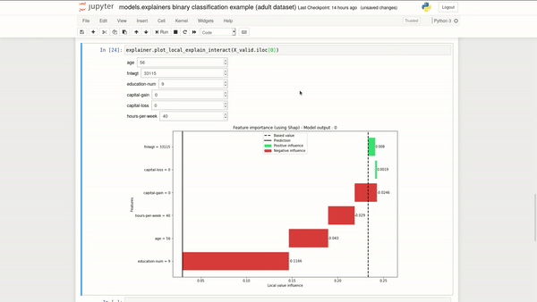

Examples
--------

### Control AI performance over time with `monitoring.monitor_model` or `monitoring.plot_monitoring`</h3>

- [Monitoring binary classification example (adult dataset)](monitoring\ binary\ classification\ example\ \(adult\ dataset\).ipynb)
- [Monitoring regression example (boston dataset)](monitoring\ regression\ example\ \(boston\ dataset\).ipynb)

----

### Try different input scenario in the model to see how it handles it with `models.explainers.ModelExplainer`

**You can find the `plot_local_explain_interact` function at the end of each notebook but without graphics because you need the notebook to be working**.

- [`models.explainers` binary classification example (adult dataset)](models.explainers\ binary\ classification\ example\ \(adult\ dataset\).ipynb)
- [`models.explainers` multi label classification example (iris dataset)](models.explainers\ multi\ label\ classification\ example\ \(iris\ dataset\).ipynb)
- [`models.explainers` regression example (boston dataset)](models.explainers\ regression\ example\ \(boston\ dataset\).ipynb)

----

### Check if your Python's package are secure with `utils.check_packages_security`

- [Check Python packages security](utils.check_packages_security example.ipynb)

----

### Validate your AI performance with `models.classification.plot_performance` or `models.regression.plot_performance`

- [`models.classification` (binary) example (adult dataset)](models.classification\ \(binary\)\ example.ipynb)
- [`models.classification` (multi labels) example (iris dataset)](models.classification\ \(multi\ labels\)\ example.ipynb)
- [`models.regression` example](models.regression\ example.ipynb)

----

### Check if the variable is coherent in its distribution with `datasets.variable.plot_variable`

- [`plot_variable` example](datasets.variable.plot_variable\ example.ipynb)

----

### Generate a performance validation report with `utils.reports.generate_validation_report`

----

### Explain the local or global behavior of your model with `models.explainers.ModelExplainer`

- [`models.explainers` binary classification example (adult dataset)](models.explainers\ binary\ classification\ example\ \(adult\ dataset\).ipynb)
- [`models.explainers` multi label classification example (iris dataset)](models.explainers\ multi\ label\ classification\ example\ \(iris\ dataset\).ipynb)
- [`models.explainers` regression example (boston dataset)](models.explainers\ regression\ example\ \(boston\ dataset\).ipynb)

----

### Check if your AI is biased on protected attributes with `fairness.model_bias` or `fairness.plot_bias`

- [Detect bias on binary classification (adult dataset)](fairness\ detect\ bias\ on\ binary\ classification\ \(adult\ dataset\).ipynb)
- [Detect bias on regression (boston dataset)](fairness\ detect\ bias\ on\ regression\ \(boston\ dataset\).ipynb)
- [Create privileged dataframe](fairness.create_privilieged_df\ example.ipynb)

----

### Get the kWh value of the AI training with `utils.evaluate_kWh`

- [Compute kWh for a Python function](utils.evaluate_kWh\ example.ipynb)